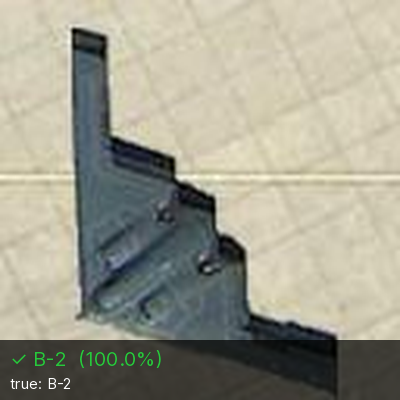
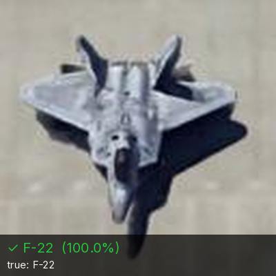
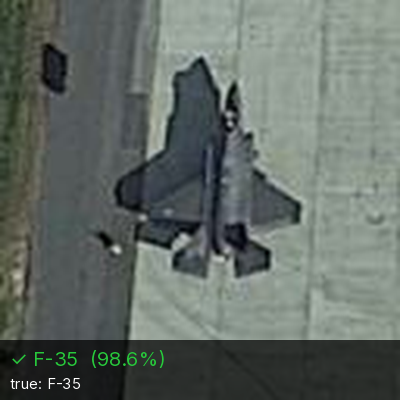
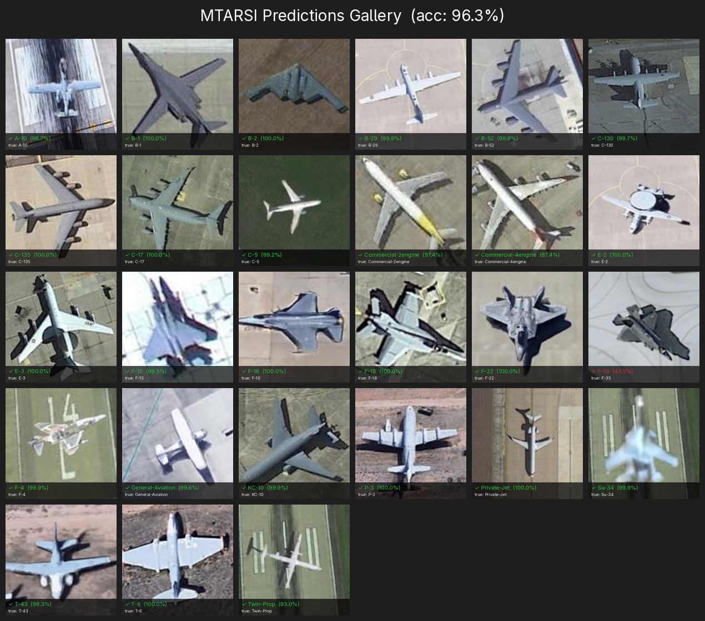

# MTARSI — Military Aircraft Classification from Satellite Imagery

Transfer-learning CNN for classifying 27 military aircraft types from 128×128 overhead/satellite imagery. Built on the [MTARSI-fixed](https://huggingface.co/datasets/amistele/MTARSI-fixed) dataset (~9,144 images).

**Performance**: ~98% validation accuracy on a held-out test split.

## Aircraft Classes (27)

| A-10 | B-1 | B-2 | B-29 | B-52 | C-130 | C-135 |
|------|-----|-----|------|------|-------|-------|
| C-17 | C-5 | Commercial-2engine | Commercial-4engine | E-2 | E-3 | F-15 |
| F-16 | F-18 | F-22 | F-35 | F-4 | General-Aviation | KC-10 |
| P-3 | Private-Jet | Su-34 | T-43 | T-6 | Twin-Prop | |

## Usage

### Train
```bash
# Create Virtual Environment
python -m venv .venv

# Install requirements
pip install -r requirements.txt

# Run the file
python classify.py
```

### Inference

```bash
# Single image
python infer.py --image plane.jpg

# Entire folder
python infer.py --dir ./test_images --top-k 5

# Glob pattern
python infer.py --glob "images/F-22/*.jpg"
```

Predictions are saved to `predictions/run_YYYYMMDD_HHMMSS/` as CSV, JSON, and a human-readable summary.

### Gallery

```bash
# Generate annotated predictions for one image per class + grid
python infer_gallery.py 
```


### Results
**a B-2 Bomber**


**an F-22**


**an F-35**


**A Commercial 4-Engine Airplane**


**A Commercial 2-Engine Airplane**


**Full Prediction Grid**



### Training

Open `classifying-military-aircraft-from-satellite.ipynb` in Jupyter/Kaggle. The notebook implements two-phase transfer learning:

1. **Phase 1** — Train classification head on frozen EfficientNet-B0 backbone
2. **Phase 2** — Finetune top layers with reduced learning rate

A from-scratch ResNet+SE model is also provided as a fallback baseline.

## Requirements

```
tensorflow>=2.12.0
scikit-learn>=1.0.0
matplotlib>=3.5.0
tqdm>=4.60.0
pillow>=9.0.0
numpy>=1.21.0
```

## Source

Derived from [amistele/MTARSI-fixed](https://huggingface.co/datasets/amistele/MTARSI-fixed) — all images resized to 128×128. License: WTFPL.
